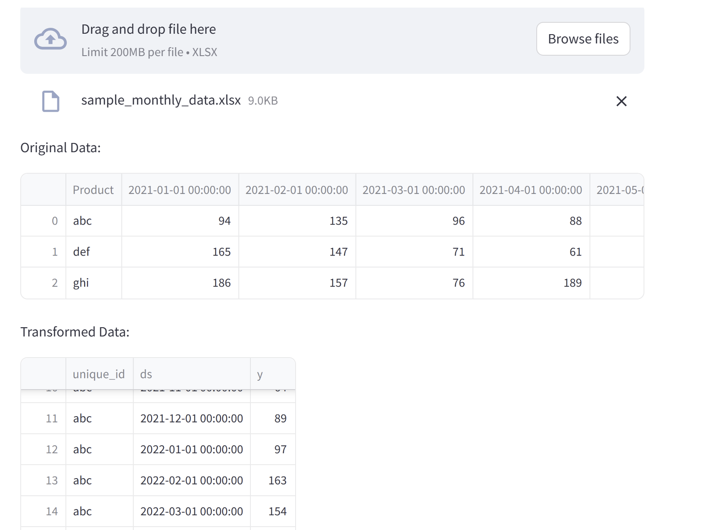
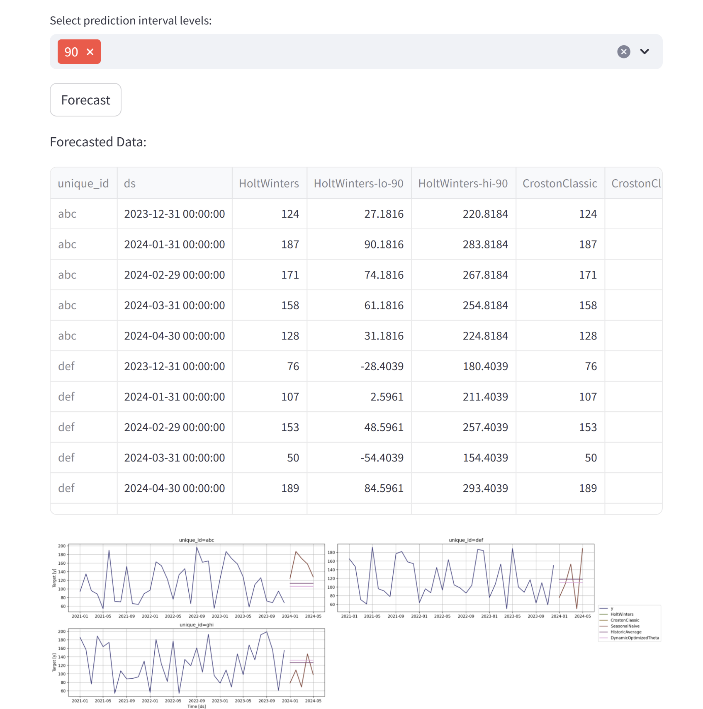

# auto-fcst
nixtla libraries + streamlit + typical excel file forma

Excel is typically formatted like this

trasform to how nixtla intakes data and generate some forecasts

this could be a mess we shall see