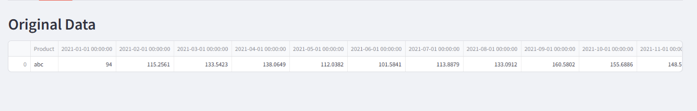
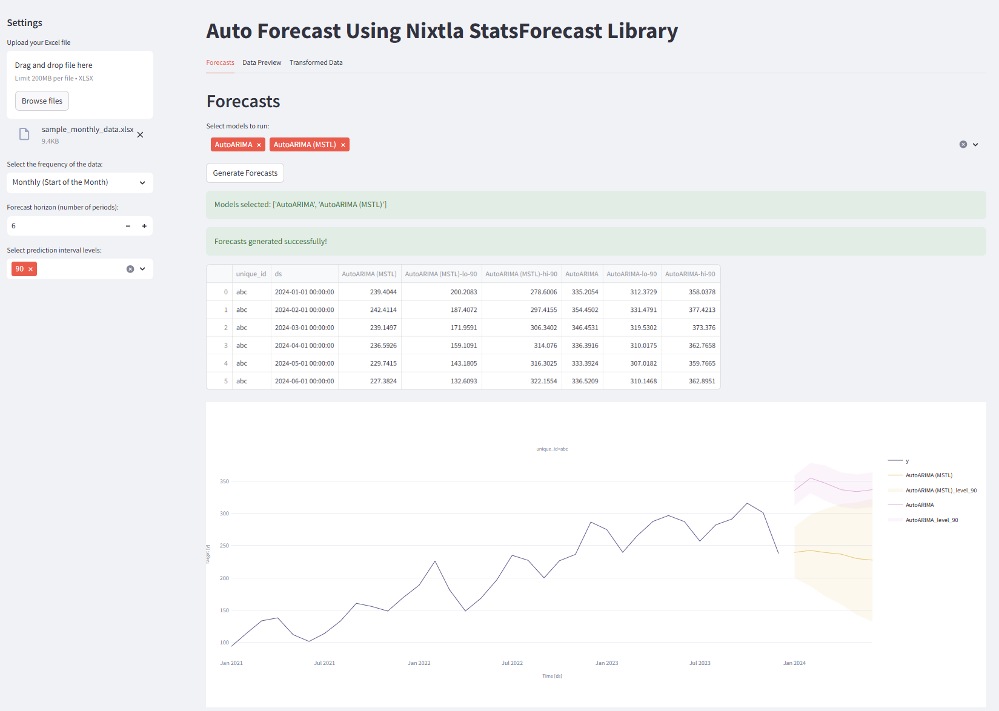

# auto-fcst
nixtla libraries + streamlit + typical excel file forma

Excel tables are typically formatted like this (Columns are time)

Trasform to how Nixtla intakes data and generate some forecasts

this could be a mess we shall see